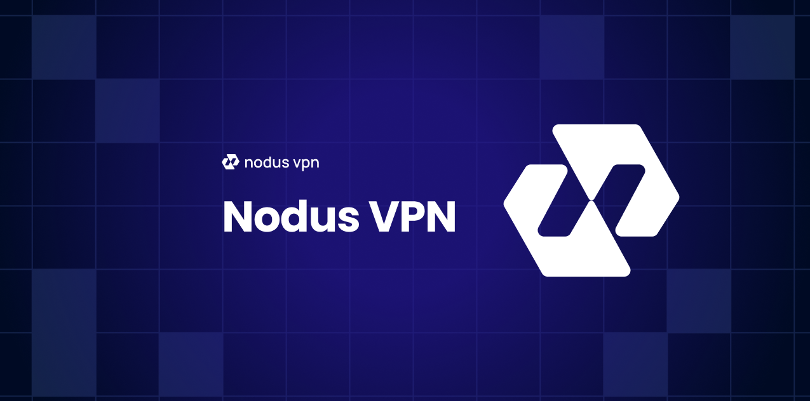

# NodusVPN

<!--Полное описание-->
## Description
NodusVPN is a decentralized VPN service that provides anonymity, security, and freedom on the Internet. It enables users to circumvent censorship and other restrictions by using servers around the world. NodusVPN operates on a fair and transparent monetization model, utilizing the NDS token, which allows users not only to pay for services but also to earn by providing servers to the community. Thanks to the absence of a central hosting center, both users and providers can maintain complete anonymity. NodusVPN uses zero-trust smart contracts, OpenVPN (udp+tcp) and Wireguard protocols, as well as asymmetric encryption to ensure security and privacy.

<!--Пользовательская документация-->
## Documentation
Read the full project description and the Nodus ecosystem at [this link](https://nodusvpn.gitbook.io/nodus-vpn/).

<!--описание контрактов-->
## Smart Contracts
| Folder | Description                                                        |
|----------|-----------------------------------------------------------------|
| token	   | NDS token contract               |
| staking      | Staking contract                                        |
| vesting       | Vesting contract                              |
| dao	   | Voiting contract                                         |
| payment	   | VPN service payment                                  |
